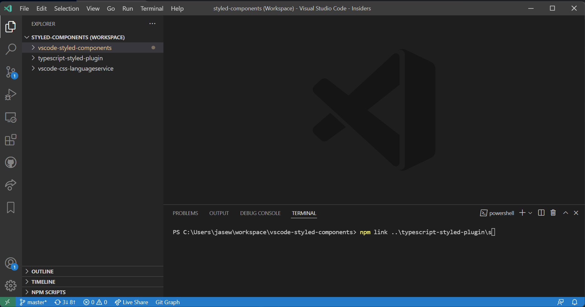

# Contributing

Start off forking, then cloning the project locally:

- `$ npm ci` - Install dependencies
- `$ npm test` - Run tests
- `$ npm run format` - Format any changes you've made with prettier
- `$ npm run lint` - Check formatting with prettier

## Syntax

The syntax is regex based, tools I've been using have include a mix of [regex101.com](https://regex101.com/) and [regexr.com](https://regexr.com/). Note that VSCode does
not use JavaScript Regex, but [oniguruma](https://github.com/kkos/oniguruma) instead. They are more compatible with the _PCRE_ flavor in these
websites. The Regex in the JSON files are string encoded, so you need to decode/encode them when copying between these websites, you can use a [tool like this](https://www.freeformatter.com/json-escape.html#ad-output). You can test your regex with the node version in a scratch pad to see which groups it matches (these may not always be what you expect) https://github.com/atom/node-oniguruma.

It can take some time to get used to the regular expressions.

To visually test your changes press `F5` while having this project open in VSCode, it will open another window with extension enabled. You can load the `colorize-fixture` folder in that window to see your changes.

Refer to JS/TS tokens syntax at https://github.com/microsoft/vscode/tree/master/extensions under `<language>/syntaxes/<lang>.tmLanguage.json`.

To check how tokens are being matched, select "Developer: Inspect Editor Tokens and Scope" under Command Palette.

### "A line break seems to break the syntax highlighting"

Many of the bugs raised are due to multiline regex not being available.
Textmate grammar can [only match a single line](https://github.com/microsoft/vscode-textmate/issues/32). Unfortunately a lot of the regex we have tries to parse multiple lines at once (which won't work).
This has caused bugs to be raised such as: https://github.com/styled-components/vscode-styled-components/issues/266 and https://github.com/styled-components/vscode-styled-components/issues/277

The best fix is to look at the new line and create a new rule in https://github.com/styled-components/vscode-styled-components/blob/master/syntaxes/styled-components.json which will match that line as close as possible whilst still being generic. Regex101 helps with this.

## Intellisense

Intellisense is handled by https://github.com/microsoft/typescript-styled-plugin.

For most things `typescript-styled-plugin` is just a [pass-through](https://github.com/microsoft/typescript-styled-plugin/blob/master/src/_language-service.ts#L87-L95) to the CSS/SCSS language services. For example, looking at [getCompletionItems](https://github.com/microsoft/typescript-styled-plugin/blob/master/src/_language-service.ts#L215-L244) you can see it just calls the equivalent on the upstream language services. So if something works natively (CSS file), but not in styled-components its most likely because it's not passing the correct events through.

### Setting up

I use VSCode's multi workspace for this (see above image). I have `typescript-styled-plugin`, `vscode-styled-components`and [`vscode-css-languageserver`](https://github.com/vscode-langservers/vscode-css-languageserver) (optional) folders loaded.

You can't run the typescript-styled-plugin directly, instead you need to load a debugger to listen on a port. The below shows you how to set this up so that you can debug both the extension and the plugin at the same time.

- Make sure `typescript-styled-plugin` is yarn|npm linked into `vscode-styled-components` (see image above)
- uncomment the plugin section in [tsconfig](https://github.com/styled-components/vscode-styled-components/blob/master/tsconfig.json#L18), make sure the path points to your local checkout of typescript styled plugin
- In `vscode-styled-components/.vscode/launch.json`, `"TSS_DEBUG": "9229"` should be set (or `"TSS_REMOTE_DEBUG": "9229"` if using WSL). This allows the debugger to communicate with the typescript-styled-plugin. These may already be set.
- [Debug Tab] Click `Launch extension` (you may get a prompt, select "debug anyway")
- Once the new window is up and running go back to the host VSCode instance and on the debug tab Click `Debug Styled Plugin` - This will both build and start the debugger on the typescript-styled-plugin project.

You should now be able to use styled-components in the guest window and set breakpoints on the both the plugin and extension in the main window.

A good starting point is setting a breakpoint [here](https://github.com/microsoft/typescript-styled-plugin/blob/4f6ad2aae15098d74fd069d646a44ae368986af4/src/_language-service.ts#L254) then trying to use completions in the guest window.

[Optional] - If you want to go even deeper and debug the css language server, you will need to yarn|npm link that into typescript plugin and then make sure typescript-plugin's [outfiles](https://github.com/microsoft/typescript-styled-plugin/blob/main/.vscode/launch.json#L9) are also pointing to the css language server's generated files on build.

More Info:

- [Example of debugging Styled Plugin](https://github.com/microsoft/typescript-styled-plugin/pull/156)
- https://github.com/microsoft/typescript-styled-plugin/issues/120#issuecomment-707400103
- https://github.com/microsoft/TypeScript/wiki/Writing-a-Language-Service-Plugin#testing-locally
- https://github.com/microsoft/TypeScript/wiki/Debugging-Language-Service-in-VS-Code#debugging-tsserver-server-side

### Logging

If you want logging, you can set `"typescript.tsserver.log": "verbose"` in your global settings (or local guest settings) and view the output, there should be a path to a log file that's printed out. Any console.log you do from the plugin will end up in there.

## Tests

You can run tests simply by running `npm test`.
This should spawn another instance of VSCode to run the end to end tests in.

The syntax tests will generate tokens for [fixtures we have](./src/tests/suite/colorize-fixtures) which are then compared to the results (adjacent folder). If there are changes and the tests fail it will generate a new result (overwriting the previous one).

When making syntax changes you should update the test suite.
