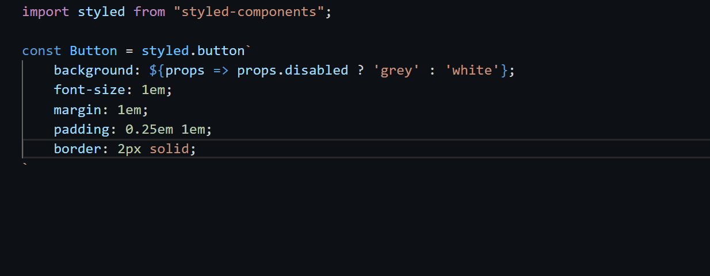

# vscode-styled-components

Styled Components has moved! Make sure you're downloading it from here:
https://marketplace.visualstudio.com/items?itemName=styled-components.vscode-styled-components. The `jpoissonnier.vscode-styled-components ` version will recieve no more updates.

<a href="https://discord.gg/hfGUrbrxaU"></a>

Syntax highlighting and IntelliSense for [styled-components](https://github.com/styled-components/styled-components).



Uses a CSS grammar built on top of [language-sass](https://github.com/atom/language-sass) and [language-css](https://github.com/atom/language-css).

## Install

Inside VSCode, press `Ctrl+P`, and enter:

```
ext install vscode-styled-components
```

It should be the top result.

[[Source](https://marketplace.visualstudio.com/items?itemName=jpoissonnier.vscode-styled-components)]

## Features

- Syntax highlighting for styled components in JavaScript and TypeScript.
- Detailed CSS IntelliSense while working in styled strings.
- Syntax error reporting.

## Usage

The styled-components extension adds highlighting and IntelliSense for styled-component template strings in JavaScript and TypeScript. See [plugin configuration](https://github.com/styled-components/typescript-styled-plugin#configuration) for information on configuring the linter and other language features.

## Raising an issue

Please check the issues list to see if it has already been raised. If it has you can vote on it with a thumbsUp emoji.
Issues with the most votes tend to be prioritised.

## Contributing

see [Contributing](./CONTRIBUTING.md)

## Troubleshooting

### There's no syntax highlighting?

Syntax Highlighting is specifically made to work with `styled` so make sure your default import is `styled` and nothing else.

See: https://github.com/styled-components/vscode-styled-components/issues/118#issuecomment-833007295

Secondly make sure your file is set to the right language. It should be `typescriptreact` or `javascriptreact`. Using the correct extensions (jsx, tsx) should help with this.

### Emmet tab completion isn't working

Be sure to include `"emmet.triggerExpansionOnTab": true` in your VSCode settings to enable tab completion.\*\* More settings and instructions can be found [here](https://code.visualstudio.com/docs/editor/emmet).

### Emmet is auto completing HTML tags instead of CSS

This is an upstream issue in VSCode unfortunately. The root cause is here: https://github.com/microsoft/vscode/issues/119736 which itself was raised from https://github.com/microsoft/vscode/issues/51537. There was an [issue raised](https://github.com/styled-components/vscode-styled-components/issues/191) in this repo but there's nothing that can be done on our end.

### I get "unknown property: X" on a property I know is valid

Property look up comes from the [css language service](https://github.com/microsoft/vscode-css-languageservice) which in turn comes from [MDN Data](https://github.com/mdn/data). If its a custom property, or something that is not in MDN you can add your own property like so: https://github.com/microsoft/typescript-styled-plugin/issues/58#issuecomment-444733368

If however you believe this property is standard and thus missing you can raise this issue with either one of the above projects; please check for any raised issue first.

### Intellisense is not working!

#### It hasn't worked since updating to v1.7.8!
This is due to a clash between TypeScript 5.0.0 and this extension. When VSCode released March 2023 that had TypeScript 5.X set by default which 1.7.8 supports but lower versions don't.
So, if you're not getting intellisense its most likely because you've updated the extension but haven't updated your version of TypeScript yet. The quick option is to downgrade to v1.7.5, the long term option is to migrate to TypeScript 5.X
See: https://github.com/styled-components/vscode-styled-components/issues/387

If it's not the above, See these issues:

- https://github.com/styled-components/vscode-styled-components/issues/357
- https://github.com/styled-components/vscode-styled-components/issues/343
